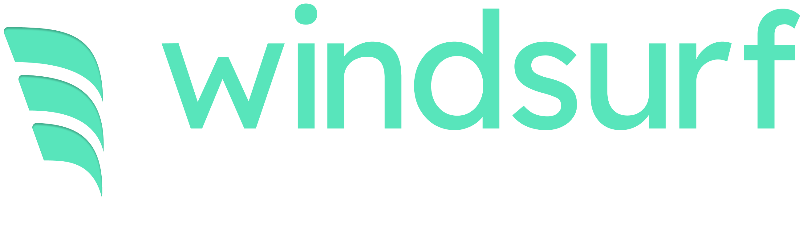

<p align="center">
  
</p>

---

[](https://discord.gg/3XFf78nAx5)
[](https://twitter.com/intent/follow?screen_name=windsurf_ai)

[](https://docs.windsurf.com)
[](https://windsurf.canny.io/)
[](https://windsurf.com?repo_name=exafunction%2Fwindsurf.vim)

[](https://marketplace.visualstudio.com/items?itemName=Codeium.codeium)
[](https://plugins.jetbrains.com/plugin/20540-codeium/)
[](https://open-vsx.org/extension/Codeium/codeium)
[](https://chrome.google.com/webstore/detail/codeium/hobjkcpmjhlegmobgonaagepfckjkceh)

# windsurf.nvim

Native [Windsurf](https://www.windsurf.com/) plugin for Neovim.

## Contributing

Feel free to create an issue/PR if you want to see anything else implemented.

## Screenshots

[Completion in Action](https://user-images.githubusercontent.com/522465/215312040-d5e91a6b-cffa-48f1-909f-360328b5af79.webm)

## Installation

### [packer.nvim](https://github.com/wbthomason/packer.nvim)

```lua
use {
    "Exafunction/windsurf.nvim",
    requires = {
        "nvim-lua/plenary.nvim",
        "hrsh7th/nvim-cmp",
    },
    config = function()
        require("codeium").setup({
        })
    end
}
```

### [lazy.nvim](https://github.com/folke/lazy.nvim)

```lua
{
    "Exafunction/windsurf.nvim",
    dependencies = {
        "nvim-lua/plenary.nvim",
        "hrsh7th/nvim-cmp",
    },
    config = function()
        require("codeium").setup({
        })
    end
},
```

## Usage

After installation and configuration, you will need to authenticate with
Windsurf. This can be done by running `:Codeium Auth`, copying the token from
your browser and pasting it into API token request.

To use Windsurf Chat, execute the `:Codeium Chat` command. The chat will be opened
in your default browser using the xdg-open command.

## Options

- `config_path`: the path to the config file, used to store the API key.
- `bin_path`: the path to the directory where the Windsurf server will be downloaded to.
- `api`: information about the API server to use:
  - `host`: the hostname. Example: `"codeium.example.com"`. Required when using enterprise mode
  - `port`: the port. Defaults to `443`
  - `path`: the path prefix to the API server. Default for enterprise: `"/_route/api_server"`
  - `portal_url`: the portal URL to use (for enterprise mode). Defaults to `host:port`
- `enterprise_mode`: enable enterprise mode
- `detect_proxy`: enable or disable proxy detection
- `enable_chat`: enable chat functionality
- `enable_cmp_source`: defaults to true. Set `false` to disable registering a `cmp` source
- `virtual_text`: configuration for showing completions in virtual text
  - `enabled`: defaults to `false`. Set `true` to enable the virtual text feature
  - `filetypes`: A mapping of filetype to true or false, to enable virtual text
  - `default_filetype_enabled`: Whether to enable virtual text of not for types not listed in `filetypes`.
  - `manual`: Set `true` to only trigger Codeium using a manual Lua function call
  - `idle_delay`: defaults to `75`. Time in ms to wait before requesting completions after typing stops.
  - `virtual_text_priority`: defaults to `65535`. Priority of the virtual text
  - `map_keys`: defaults to `true`. Set `false` to not set any key bindings for completions
  - `accept_fallback`: Emulate pressing this key when using the accept key binding but there is no completion. Defaults
  to "\t"
  - `key_bindings`: key bindings for accepting and cycling through completions
    - `accept`: key binding for accepting a completion, default is `<Tab>`
    - `accept_word`: key binding for accepting only the next word, default is not set
    - `accept_line`: key binding for accepting only the next line, default is not set
    - `clear`: key binding for clearing the virtual text, default is not set
    - `next`: key binding for cycling to the next completion, default is `<M-]>`
    - `prev`: key binding for cycling to the previous completion, default is `<M-[>`
- `workspace_root`:
  - `use_lsp`: Use Neovim's LSP support to find the workspace root, if possible.
  -	`paths`: paths to files that indicate a workspace root when not using the LSP support
  - `find_root`: An optional function that the plugin will call to find the workspace root.
- `tools`: paths to binaries used by the plugin:

  - `uname`: not needed on Windows, defaults given.
  - `uuidgen`
  - `curl`:
  - `gzip`: not needed on Windows, default implemenation given using powershell.exe Expand-Archive instead

  - `language_server`: The path to the language server downloaded from the [official source.](https://github.com/Exafunction/codeium/releases/tag/language-server-v1.1.32)

- `wrapper`: the path to a wrapper script/binary that is used to execute any
  binaries not listed under `tools`. This is primarily useful for NixOS, where
  a FHS wrapper can be used for the downloaded codeium server.

### [nvim-cmp](https://github.com/hrsh7th/nvim-cmp)

After calling `setup`, this plugin will register a source in nvim-cmp. nvim-cmp
can then be set up to use this source using the `sources` configuration:

```lua
cmp.setup({
    -- ...
    sources = {
        -- ...
        { name = "codeium" }
    }
})
```

If you are seeing the `codeium` source as unused in `:CmpStatus`, make sure that `nvim-cmp` setup happens before the `windsurf.nvim` setup.

To set a symbol for windsurf using lspkind, use the `Codeium` keyword. Example:

```lua
cmp.setup({
    -- ...
    formatting = {
        format = require('lspkind').cmp_format({
            mode = "symbol",
            maxwidth = 50,
            ellipsis_char = '...',
            symbol_map = { Codeium = "", }
        })
    }
})
```

### Virtual Text

The plugin supports showing completions in virtual text. Set `virtual_text.enabled` in the options to `true` to enable it.

```lua
require("codeium").setup({
    -- Optionally disable cmp source if using virtual text only
    enable_cmp_source = false,
    virtual_text = {
        enabled = true,

        -- These are the defaults

        -- Set to true if you never want completions to be shown automatically.
        manual = false,
        -- A mapping of filetype to true or false, to enable virtual text.
        filetypes = {},
        -- Whether to enable virtual text of not for filetypes not specifically listed above.
        default_filetype_enabled = true,
        -- How long to wait (in ms) before requesting completions after typing stops.
        idle_delay = 75,
        -- Priority of the virtual text. This usually ensures that the completions appear on top of
        -- other plugins that also add virtual text, such as LSP inlay hints, but can be modified if
        -- desired.
        virtual_text_priority = 65535,
        -- Set to false to disable all key bindings for managing completions.
        map_keys = true,
        -- The key to press when hitting the accept keybinding but no completion is showing.
        -- Defaults to \t normally or <c-n> when a popup is showing. 
        accept_fallback = nil,
        -- Key bindings for managing completions in virtual text mode.
        key_bindings = {
            -- Accept the current completion.
            accept = "<Tab>",
            -- Accept the next word.
            accept_word = false,
            -- Accept the next line.
            accept_line = false,
            -- Clear the virtual text.
            clear = false,
            -- Cycle to the next completion.
            next = "<M-]>",
            -- Cycle to the previous completion.
            prev = "<M-[>",
        }
    }
})
```

#### Virtual Text Keybindings

The plugin defines a number of key bindings for managing completion in virtual text mode. You can override these by
setting `virtual_text.key_bindings`. If you don't want any key bindings, set `virtual_text.map_keys` to `false`, or
you can set specific bindings to `false`.

When `manual` mode is enabled, you can call any of these functions to show completions:

```lua
-- Request completions immediately.
require('codeium.virtual_text').complete()

-- Request a completion, or cycle to the next if we already have some
require('codeium.virtual_text').cycle_or_complete()

-- Complete only after idle_delay has passed with no other calls to debounced_complete().
require('codeium.virtual_text').debounced_complete()
```

#### Virtual Text Filetypes

You can set the `filetypes` and `default_filetype_enabled` options in the `virtual_text` table to configure which filetypes
should use virtual text.

```lua
require('codeium.virtual_text').setup({
    virtual_text = {
        filetypes = { 
            python = true,
            markdown = false
        },
        default_filetype_enabled = true
    }
})
```

### Show Windsurf status in statusline

When using virtual text, Windsurf status can be generated by calling `require('codeium.virtual_text').status_string()`. 
It produces a 3 char long string with Windsurf status:

- `'3/8'` - third suggestion out of 8
- `'0'` - Windsurf returned no suggestions
- `'*'` - waiting for Windsurf response

In order to show it in status line add following line to your `.vimrc`:

```set statusline+=%3{v:lua.require('codeium.virtual_text').status_string()}```

Please check `:help statusline` for further information about building statusline in VIM.

The `status_string` function can also be used with other statusline plugins.
You can call the `set_statusbar_refresh` function to customize how the plugin refreshes the
status bar. 

For example, this sets up the plugin with lualine:

```lua
require('codeium.virtual_text').set_statusbar_refresh(function()
	require('lualine').refresh()
end)
```

For more customization, you can also call the `status` function which returns an object that can be used to create a
status string.

```lua
function custom_status()
	local status = require('codeium.virtual_text').status()

	if status.state == 'idle' then
		-- Output was cleared, for example when leaving insert mode
        return ' '
    end

	if status.state == 'waiting' then
		-- Waiting for response
		return "Waiting..."
    end

	if status.state == 'completions' and status.total > 0 then
        return string.format('%d/%d', status.current, status.total)
    end

	return ' 0 '
end
```

### Workspace Root Directory

The plugin uses a few techniques to find the workspace root directory, which helps to inform the autocomplete and chat context. 

1. Call the optional `workspace_root.find_root` function, if provided. This is described below.
2. Query Neovim's built-in LSP support for the workspace root, if `workspace_root.use_lsp` is not set to `false`.
3. Search upward in the filesystem for a file or directory in `workspace_root.paths` that indicates a workspace root.

The default configuration is:

```lua
require('codeium').setup({
	workspace_root = {
		use_lsp = true,
		find_root = nil,
		paths = {
			".bzr",
			".git",
			".hg",
			".svn",
			"_FOSSIL_",
			"package.json",
		}
	}
})
```

The `find_root` function can help the plugin find the workspace root when you are not using Neovim's built-in LSP
provider. For example, this snippet calls into `coc.nvim` to find the workspace root.

```lua
require('codeium').setup({
	workspace_root = {
		find_root = function()
			return vim.fn.CocAction("currentWorkspacePath")
		end
	}
})
```

## Troubleshooting

The plugin log is written to `~/.cache/nvim/codeium/codeium.log`.

You can set the logging level to one of `trace`, `debug`, `info`, `warn`,
`error` by exporting the `DEBUG_CODEIUM` environment variable.

## Credits

This plugin was initially developed by [@jcdickinson](https://github.com/jcdickinson).
